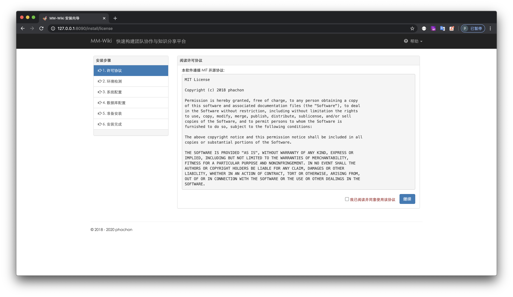
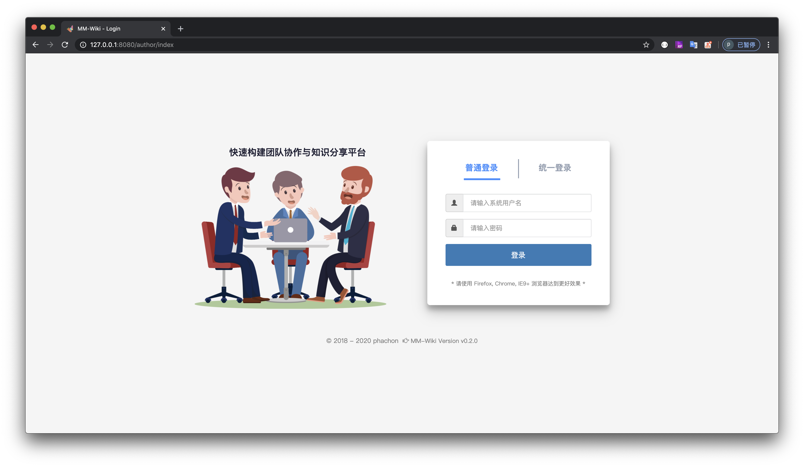
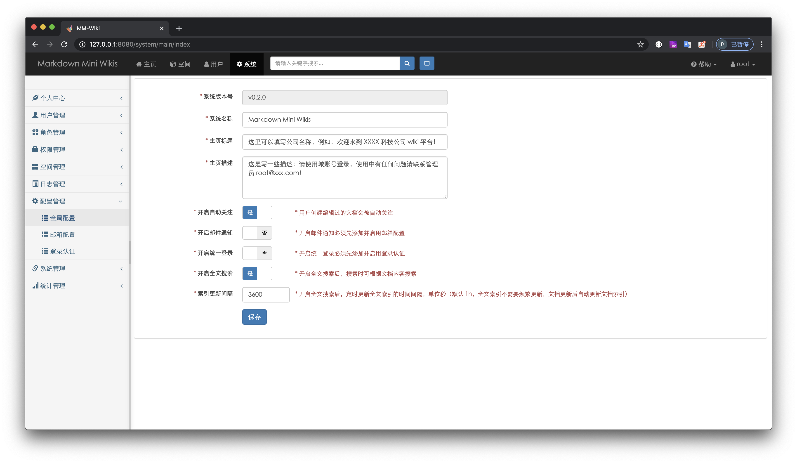
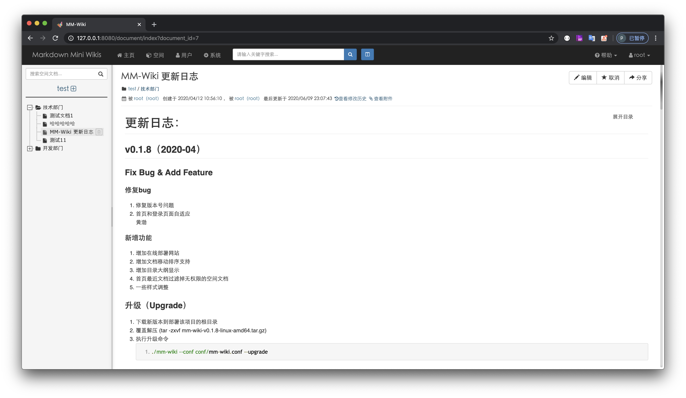
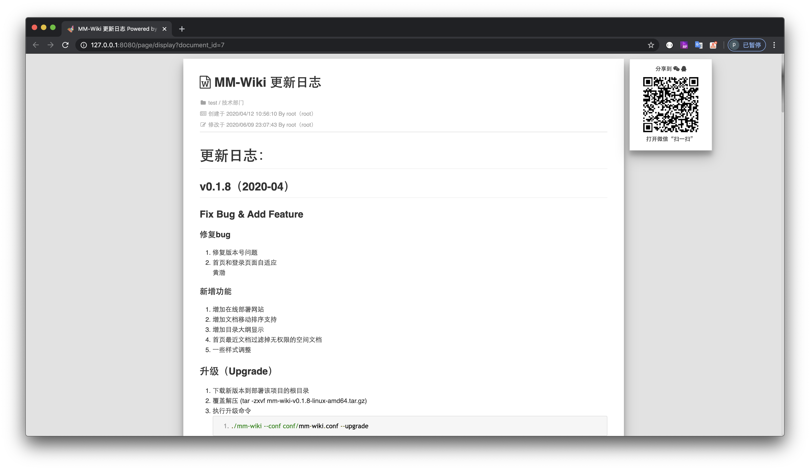

<h2 align="center">


</h2>

<div align="center">

</br>


</div>

# 特点
- 部署方便，基于 golang 编写，只需要下载对于平台下二进制文件执行即可。
- 快速安装程序, 提供方便的安装界面程序，无需任何手动操作。
- 独立的空间，空间是一组文档的集合，一般为公司部门或者团队，空间下的文档相互独立。空间可根据需求设置空间访问级别。
- 支持 markdown 语法写作，支持附件上传。
- 完善的系统权限管理，系统可以自定义角色，并为不同角色授予不同的权限。
- 集成统一登录，本系统支持通过外部系统认证用户, 比如与公司的 LDAP 登录融合。具体请看登录认证功能。
- 邮件通知功能，当开启邮件通知，文档更改会通知所有关注该文档的用户。
- 文档具有分享和下载功能，目前只支持下载 MarkDown 源文件。
- 支持文档全文搜索

# 在线快速了解


# 安装
## 1. 自助安装


- Linux 平台

    ```
    # 创建目录
    $ mkdir code_explore
    $ cd code_explore
    # 以 linux amd64 为例，下载最新版本压缩包
    # code-explore.tar.gz
    # 解压到当前目录
    $ tar -zxvf code-explore-linux-amd64.tar.gz
    # 进入程序安装目录
    $ cd install
    # 执行安装程序，默认端口为 8090，指定其他端口加参数 --port=8087
    $ ./install
    # 浏览器访问 http://ip:8090 进入安装界面，完成安装配置
    # Ctrl + C 停止 install 程序, 启动 code-explore 系统
    $ cd ..
    $ ./code-explore --conf conf/default.conf
    # 浏览器访问你监听的 ip 和端口
    # 开始 code-explore 的使用之旅吧！
    ```

- Windows 平台

    ```
    # 以 windows amd64 为例，下载最新版本压缩包
    # code-explore.tar.gz
    # 手动解压到当前目录
    # 进入 install 目录
    # 双击点开 install.exe 文件
    # 浏览器访问 http://ip:8090 进入安装界面，完成安装配置
    # 关闭刚刚点开的 install 窗口
    # 使用 windows 命令行工具（cmd.exe）进入程序根目录
    $ 执行 code-explore.exe --conf conf/default.conf
    # 浏览器访问你监听的 ip 和端口
    # 开始 code-explore 的使用之旅吧！
    ```

- Docker 部署
    ```
    # 数据库准备
    # 导入docs/databases/data.sql和docs/databases/table.sql（注：需取消注释data.sql中第一条管理用户插入语句）

    # 两种部署方式可用
    # DockerHub（推荐）
    # 从DockerHub下载v0.1.7版本
    # 新增配置文件，数据存放目录以及Mysql数据库配置在code-explore.conf配置文件中设置
    # 挂载配置文件及数据存放目录，启动端口为8080
    # docker run -d -p 8080:8081 -v /data/code-explore/conf/:/opt/code-explore/conf/ -v /data/code-explore/data:/data/code-explore/data/ --name code-explore eahom/code-explore:v0.1.7

    # 本地构建最新代码
    # 构建项目镜像
    # docker build -t code-explore-image .
    # 新增配置文件，数据存放目录以及Mysql数据库配置在code-explore.conf配置文件中设置
    # 挂载配置文件及数据存放目录，启动端口为8080
    # docker run -d -p 8080:8081 -v /data/code-explore/conf/:/opt/code-explore/conf/ -v /data/code-explore/data/:/data/code-explore/data/ --name code-explore code-explore-image
    ```
## 2. 如果需要，可用 nginx 配置反向代理
```
upstream frontends {
    server 127.0.0.1:8088; # code-explore 监听的ip:port
}
server {
    listen      80;
    server_name wiki.intra.xxxxx.com www.wiki.intra.xxxxx.com;
    location / {
        proxy_pass_header Server;
        proxy_set_header Host $http_host;
        proxy_redirect off;
        proxy_set_header X-Real-IP $remote_addr;
        proxy_set_header X-Scheme $scheme;
        proxy_pass http://frontends;
    }
    # 静态资源交由nginx管理
    location /static {
        root        /www/code-explore; # code-explore 的根目录
        expires     1d;
        add_header  Cache-Control public;
        access_log  off;
    }
}
```

# 系统预览

### 1 安装

### 2 登录

### 3 系统

### 4 空间文档

### 5 编辑文档

### 6 文档分享


# 使用的一些插件

code-explore 是站在巨人的肩膀上开发的一款软件，是因为系统中使用了非常多优秀的插件，非常感谢这些插件的作者们：

- [bootstrap](https://github.com/twbs/bootstrap)
- [awesome-bootstrap-checkbox](https://github.com/flatlogic/awesome-bootstrap-checkbox)
- [bootstrap-iconpicker](https://victor-valencia.github.com/bootstrap-iconpicker)
- [bootstrap-select](http://silviomoreto.github.io/bootstrap-select)
- [bootstrap-switch](https://bttstrp.github.io/bootstrap-switch)
- [bootstrap-tagsinput](https://github.com/bootstrap-tagsinput/bootstrap-tagsinput)
- [editor.md](https://github.com/pandao/editor.md)
- [layout](http://jquery-dev.com)
- [layer](http://layer.layui.com/)
- [metisMenu](https://github.com/onokumus/metisMenu)
- [morris](http://morrisjs.github.com/morris.js/)
- [popover](https://github.com/sandywalker/webui-popover)
- [scrollup](http://markgoodyear.com/labs/scrollup/)
- [zTreev3](http://treejs.cn/)

# 二次开发

环境要求：go 1.8
```
$ git clone http://git.yungov.cn/RDC/code-explore.git
$ cd code-explore
$ go build ./
```
